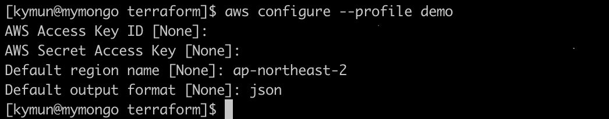

### prerequisite for aws

* aws cli installation
  check how-to on [here](https://docs.aws.amazon.com/cli/latest/userguide/cli-chap-install.html)  
  
  > *sample for linux*  
  > curl -o https://bootstrap.pypa.io/get-pip.py  
  > python get-pip.py --user or python3 get-pip.py --user  
  > pip3 install awscli --upgrade --user  

* configuration of aws profile
  During this process, you need IAM access key and secret key which have the proper permission to provision. 
  > $ aws configure --profile {profile name}  
  
  

### prerequisite for azure

* azure cli installation
  If you want to use any different method for authenticating to Azure, check on [here](https://www.terraform.io/docs/providers/azurerm/auth/azure_cli.html).
  
  check how-to on [here](https://docs.microsoft.com/en-us/cli/azure/install-azure-cli?view=azure-cli-latest)

  > *sample for linux*   
  > sudo rpm --import https://packages.microsoft.com/keys/microsoft.asc
  > sudo sh -c 'echo -e "[azure-cli]\nname=Azure CLI\nbaseurl=https://packages.microsoft.com/yumrepos/azure-cli\nenabled=1\ngpgcheck=1\ngpgkey=https://packages.microsoft.com/keys/microsoft.asc" > /etc/yum.repos.d/azure-cli.repo'
  > sudo yum install azure-cli
  
* azure configuration
  > $ az login  
  > $ az account list   
  > $ az account set --subscription="${subscriptionid}>" 
  
  > Create service principal to run terraform. default RBAC role for the service principal is Contributor.  
  > Note the output : appId, password, sp_name, tenant  
  > $ az ad sp create-for-rbac --role="Contributor" --scopes="/subscriptions/${subscriptionid}"  

### prerequisite for gcp (TODO)
